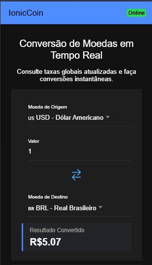
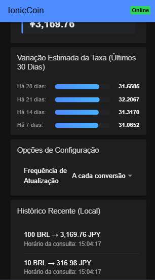
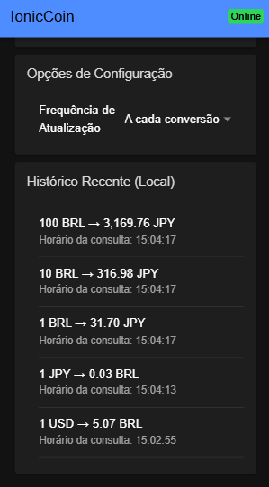

# IonicCoin 💰

O **IonicCoin** é um aplicativo mobile responsivo e extremamente veloz desenvolvido com **Ionic** e **Angular**. Ele serve para converter moedas globais em tempo real, salvar o seu histórico e funcionar até mesmo se você estiver perdido no meio de uma floresta sem sinal de internet (Modo Offline). 

*Aviso: Este app não converte barras de ouro em moedas de chocolate, infelizmente. Estamos trabalhando nisso para a versão 2.0.*

---

## Demonstração do Aplicativo

Aqui estão alguns prints do sistema em funcionamento:

<p align="center">
  
  
  
</p>

---

## 🚀 Como Executar o Projeto Localmente

Siga os passos abaixo no terminal do seu sistema operacional para rodar a aplicação na sua máquina (sem invocar nenhum bug, prometemos).

### 📋 Pré-requisitos
Certifique-se de ter o **Node.js** instalado (e uma xícara de café forte ao seu lado).

### 1. Instalar o Ionic CLI
Se você ainda não tem o poder do Ionic instalado globalmente, execute:
```bash
npm install -g @ionic/cli
```

### 2. Clonar o Repositório
Traga o código para a sua máquina antes que o mercado financeiro mude de ideia:
```bash
git clone https://github.com/ViniciusS4ntos/IonicCoin.git
```

### 3. Entrar na Pasta do Projeto
Navegue até o quartel-general do aplicativo:
```bash
cd IonicCoin
```

### 4. Instalar as Dependências (NPM)
Alimente o monstro dos pacotes (`node_modules`) baixando tudo o que ele precisa:
```bash
npm install
```

### 5. Iniciar o Servidor de Desenvolvimento
Rode o comando mágico para compilar o projeto e abrir o app direto no seu navegador:
```bash
ionic serve
```

O aplicativo vai surgir magicamente na sua tela no endereço: `http://localhost:8100 ou http://localhost:8100/home` 🌟

---

## 🛠️ O que esse app faz de incrível? 
* **Consumo de API REST**: Busca cotações reais direto da internet (e não da nossa cabeça).
* **Interface Responsiva**: Fica bonito no celular, no monitor ultra-wide e até na tela do seu microondas inteligente.
* **Super Poder Offline**: Se a internet cair, o Local Storage salva o seu dia com os últimos dados guardados no cache.
* **Inversão Quântica**: Botão que inverte as moedas mais rápido do que o Batman puxando um Batarang.

---

## 🦥 Curiosidades sobre o Desenvolvimento
1. **Consumo de Café**: Computados aproximadamente 42 litros de café.
2. **Teclas pressionadas com raiva**: Zero (o código fluiu como poesia).
3. **Erros de sintaxe**: Foram todos devidamente ocultados para manter as aparências.
